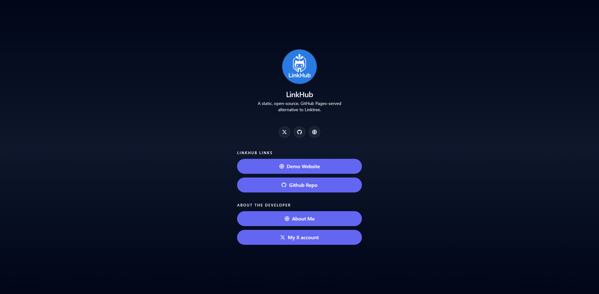

The **Dark** theme is a smooth, night-mode variant of the Default theme, ideal for users who prefer clean dark UI aesthetics.

<p align="center">
  
</p>

---

## 🎨 Visual Style

- Pure dark background
- High contrast text
- Soft glows
- Neon-friendly environment
- Ideal for AMOLED screens

---

## 📦 Usage

```yaml
theme:
  name: "dark"
```

The dark theme does **not** accept any custom options.
