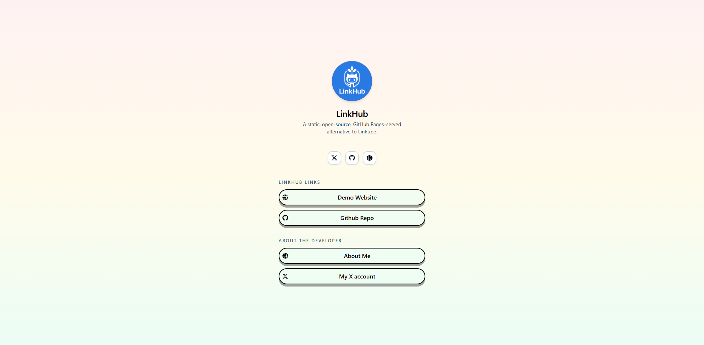

The **Default** theme provides a clean, minimal, modern layout with neutral colors and a soft design. It is the recommended starting point for creating your own custom themes.

<p align="center">
  
</p>

---

## 🎨 Visual Style

- Light, elegant appearance
- Smooth gradients
- Rounded buttons
- Subtle shadows
- Clear and readable typography

---

## 📦 Usage

```yaml
theme:
  name: "default"
```

The default theme does **not** accept any options.
