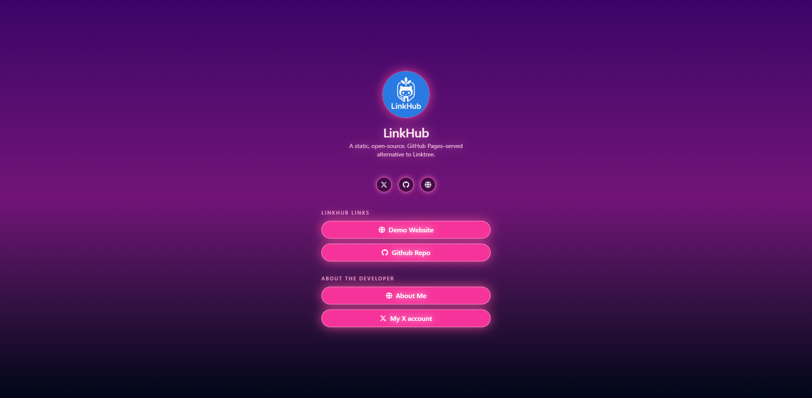
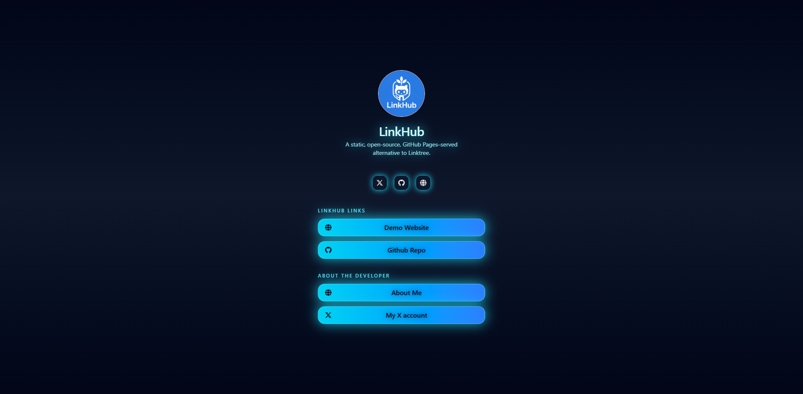

The **Neon** theme transforms your LinkHub page into a glowing neon experience with vivid pink or futuristic cyan styling.

---

# 🌈 Styles

The theme supports two styles:

| Style | Description |
|-------|-------------|
| **old** | Pink / purple retro neon (default) |
| **futur** | Cyan / blue futuristic neon |

---

## 📦 Usage

### Retro Neon (default)

<p align="center">
  
</p>

```yaml
theme:
  name: "neon"
  options:
    style: "old"
```

### Futuristic Cyan Neon

<p align="center">
  
</p>

```yaml
theme:
  name: "neon"
  options:
    style: "futur"
```

If `options.style` is missing, "old" is automatically used.
